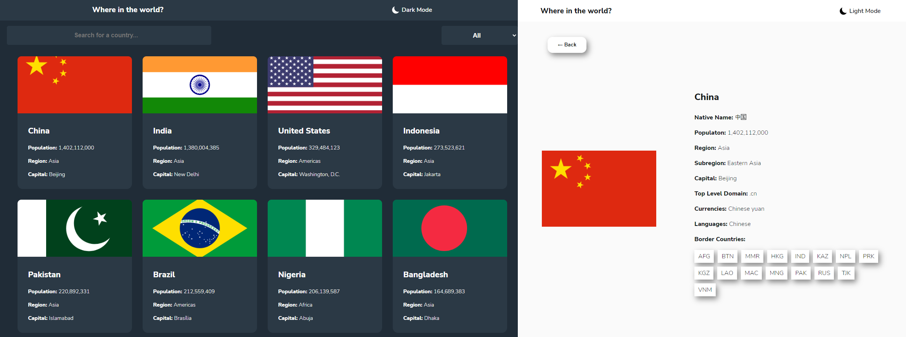
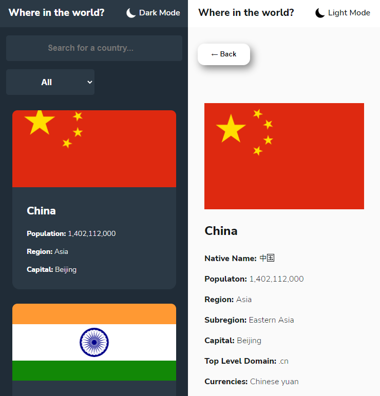
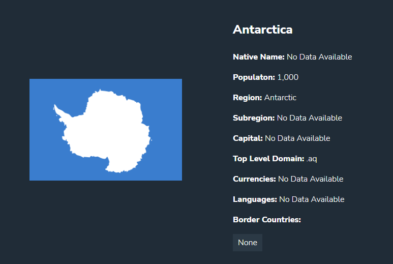

# Frontend Mentor - REST Countries API with color theme switcher solution

This is a solution to the [REST Countries API with color theme switcher challenge on Frontend Mentor](https://www.frontendmentor.io/challenges/rest-countries-api-with-color-theme-switcher-5cacc469fec04111f7b848ca). Frontend Mentor challenges help you improve your coding skills by building realistic projects.

## Table of contents

- [Overview](#overview)
  - [The challenge](#the-challenge)
  - [Screenshot](#screenshot)
  - [Links](#links)
- [My process](#my-process)
  - [Built with](#built-with)
  - [What I learned](#what-i-learned)
- [Author](#author)

## Overview

### The challenge

Users should be able to:

- See all countries from the API on the homepage
- Search for a country using an `input` field
- Filter countries by region
- Click on a country to see more detailed information on a separate page
- Click through to the border countries on the detail page
- Toggle the color scheme between light and dark mode _(optional)_

### Screenshot

### Links

- Solution URL: [https://github.com/Helbindi/rest-countries-api](https://github.com/Helbindi/rest-countries-api)
- Live Site URL: [https://helbindi-rest-countries-api.vercel.app/](https://helbindi-rest-countries-api.vercel.app/)

## My process

### Built with

- Semantic HTML5 markup
- CSS custom properties
- Flexbox
- CSS Grid
- Mobile-first workflow
- [React](https://reactjs.org/) - JS library
- axios

### What I learned

The main learning goal of this project was retrieving and manage the data acquired from a REST API.

- For this project, I used axios to handle data retrieval from the API and stored the response in a useState. All data shown on the screen will be derived from this useState, that way the user wont be making multiple API calls whenever they want to swap Counties.
- This project also required usage of Array methods such as Array.filter() to perform the filtering/query of the data.
- The data recieved from the API can be missing some values such as currencies and native name for smaller countries. For example: [Antartica]([https://restcountries.com/v3.1/name/Antarctica)
- 

## Author

- Website - [https://my-projects-site.vercel.app/](https://my-projects-site.vercel.app/)
- Frontend Mentor - [@Helbindi](https://www.frontendmentor.io/profile/Helbindi)
